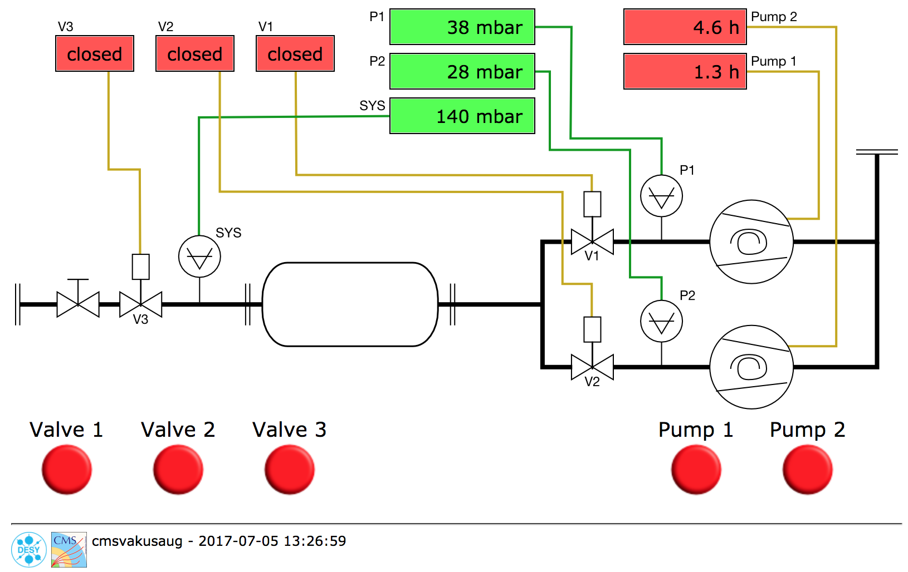

# Usage

# PumpStationControl

the command line program `PumpStationControl` communicates with the `PumpStationDaemon`
by sending commands and receiving and printing the daemon response on the command line.
The daemon understands the following commands:

* <b>setPumpState [int pump] [int state]</b> 
switches on or off a pump. [int pump] can be either 1 or 2, [int state] is either 1 for
ON or 0 for OFF.

* <b>getPumpState [int pump]</b> 
returns the state of a pump. [int pump] can be either 1 or 2. The returned value is
either 1 if the pump is ON or 0 if it is OFF.

* <b>setPumpOperatingHours [int pump] [double hours]</b> 
Sets the operating hours of a pump. [int pump] can be either 1 or 2, [double hours] is
the number of hours the pump has been running. This command can be used to synchronize
the operating hours of a pump stored in the daemon config file with the actual value
measured by the pump itself.

* <b>getPumpOperatingHours</b> 
returns the operating hours of both pumps in hours separated by a semicolon.

* <b>setValveState [int valve] [int state]</b> 
opens or closes a valve. [int valve] can be either 1, 2 or 3, [int state] is either 1 for
OPEN or 0 for CLOSED.

* <b>getValveState [int valve]</b> 
returns the state of a valve. [int valve] can be either 1, 2 or 3. The returned value is
either 1 if the valve is OPEN or 0 if it is CLOSED.

* <b>getPressure [int gauge]</b> 
returns the pressure reading of a gauge in mbar. [int gauge] can be either 1, 2 or 3.

* <b>getVacuumStatus</b> 
returns the status and pressure reading of all three gauges. The individual values are separated
by semicolons.

